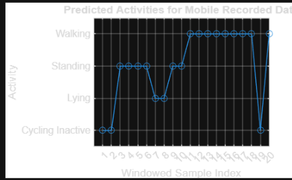
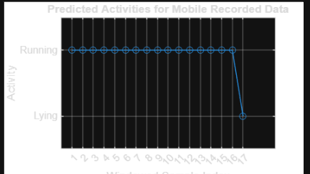

# EdgeHAR: Efficient Human Activity Recognition Using IMU Sensors

### Project Overview
This project addresses the challenge of deploying Human Activity Recognition (HAR) on edge devices with limited processing power. We processed 50Hz accelerometer data from 2 three-axial Axivity AX3 accelerometers to classify distinct activities, including static postures (Sitting, Standing) and dynamic movements (Running, Cycling, Stairs).

This repository is a submission Solution to MATLAB and Simulink Challenge project <'232'> <'Human Motion Recognition Using IMUs'>

[Program Link](https://github.com/mathworks/MATLAB-Simulink-Challenge-Project-Hub)

[Project description Link](https://github.com/mathworks/MATLAB-Simulink-Challenge-Project-Hub/tree/main/projects/Human%20Motion%20Recognition%20Using%20IMUs)

---

# Prerequisites & Setup

To run this project, ensure you have the following installed:

* MATLAB (R2021a or later recommended)
* Statistics and Machine Learning Toolbox
* Signal Processing Toolbox

# Getting Started

**Clone the repository:**
```bash
git clone https://github.com/bcap52/EdgeHAR-Efficient-Human-Activity-Recognition-Using-IMU-Sensors.git
```

# How to Run

You have two options for running this project.

## Option 1: Automated Pipeline (Fastest)

Use this option if you want to run the model immediately using the pre processed data and pre trained model included in this repository.

### 1. Testing Data:
* The testing CSV files are already included in the `Testing Datasets/` folder of this repository. No download is needed.

### 2. Verify Files:
* Ensure `src/`, `models/`, `Testing Datasets/`, and `Data/processed/ProcessedData.mat` are present in your directory (these are all included in the repo).
* Make sure to follow this project structure on your machine:

  ####  Project Structure for Option 1

```text
EdgeHAR/
│
├── Data/                                        
│   ├── processed/                               # Contains the .mat file used by the script
│   │   └── ProcessedData.mat                    # Pre processed data
│   ├── Mobile Recordings/                       # MATLAB Mobile sensor recordings
│   │   ├── sensorlog_20260316_152037.mat        # Included mobile recording sessions
│   │   └── sensorlog_20260316_154116.mat
│   ├── S020.csv, S006.csv, ...                  # Training CSV files (included)
│   └── Link to download Training sets...txt     # Link to original HARTH dataset
│
├── models/                                      # Saved models directory
│   └── trainedModel.mat                         # The pre trained classifier
│
├── src/                                         # Source code & workspaces
│   ├── Classification_LearnerApp_Workspace.mat  # Session file for MATLAB App
│   ├── Data_PreProcessing_FeatureEngineering.m  # Helper function for data processing
│   └── trainClassifier.m                        # Helper function for model training
│
├── Testing Datasets/                            # Testing data directory (included in repo)
│   └── S016.csv, S025.csv, ...                  # Testing CSV files (included)
│
├── main_script.mlx                              # MAIN SCRIPT: Run this to start
```


### 3. Run the Script:
* Open `main_script.mlx` in MATLAB.
* Click **Run**.
* The script will instantly load the processed data and the trained model to display the results.

## Option 2: Process from Scratch (Raw Data)

Use this option if you want to regenerate the dataset features from the raw CSV files yourself (e.g., if you want to see the preprocessing happen in real time).

### 1. Delete Existing Data:
* Delete the file `Data/processed/ProcessedData.mat` (if it exists).

### 2. Verify Data:
* **Training Data:** Already included in the `Data/` folder of this repository.
* **Testing Data:** Already included in the `Testing Datasets/` folder of this repository.
* Ensure `src/`, `models/`, `Data/`, and `Testing Datasets/` are present in your directory (these are all included in the repo).

   ####  Project Structure for Option 2

```text
EdgeHAR/
│
├── Data/                                        
│   ├── Mobile Recordings/                       # MATLAB Mobile sensor recordings
│   │   ├── sensorlog_20260316_152037.mat        # Included mobile recording sessions
│   │   └── sensorlog_20260316_154116.mat
│   ├── S020.csv, S006.csv, ...                  # Training CSV files (included)
│   └── Link to download Training sets...txt     # Link to original HARTH dataset
│
├── models/                                      # Saved models directory
│   └── trainedModel.mat                         # The pre trained classifier
│
├── src/                                         # Source code & workspaces
│   ├── Classification_LearnerApp_Workspace.mat  # Session file for MATLAB App
│   ├── Data_PreProcessing_FeatureEngineering.m  # Helper function for data processing
│   └── trainClassifier.m                        # Helper function for model training
│
├── Testing Datasets/                            # Testing data directory (included in repo)
│   └── S016.csv, S025.csv, ...                  # Testing CSV files (included)
│
├── main_script.mlx                              # MAIN SCRIPT: Run this to start
```


### 3. Run the Script:
* Open `main_script.mlx` and click **Run**.
* The script will detect that the processed data is missing and will automatically start reading the raw CSVs, windowing the data, and extracting features before training the model.

## Visualization & Retraining

This repository includes a saved session file for the Classification Learner App, allowing you to explore the data visually or train different models (SVM, KNN, Trees) without writing code.

1. Open the Classification Learner app in MATLAB.
2. In the "New Session" section, click the arrow and select **Open Session**.
3. Navigate to `src/Classification_LearnerApp_Workspace.mat` and open it.
4. You can now view detailed Confusion Matrices, ROC Curves, and Parallel Coordinate Plots, or train new models on the dataset.


# Project Details


### 1. Data Pipeline & Feature Engineering
**Preprocessing**
* **Cleaning:** Discarded the first **250 rows (5s)** of every session to remove sensor initialization artifacts.
* **Balancing:** Cap limit of **19,974 rows** per class to prevent bias toward dominant activities like Walking.


| Label | Activity | Notes |
| :--- | :--- | :--- |
| **1** | walking | |
| **2** | running | |
| **3** | shuffling | standing with leg movement |
| **4** | stairs (ascending) | |
| **5** | stairs (descending) | |
| **6** | standing | |
| **7** | sitting | |
| **8** | lying | |
| **13** | cycling (sit) | |
| **14** | cycling (stand) | |
| **130** | cycling (sit, inactive) | cycling (sit) without leg movement |


*What activity each class corresponds to*

---


<h3>2. Feature Extraction (12 Dimension Vector)</h3>
<p>
  We applied a <strong>2.5s sliding window</strong> (125 samples) to extract time-domain features:
  <ul>
    <li><strong>Mean:</strong> Captures static orientation (e.g., Thigh vertical vs. horizontal).</li>
    <li><strong>Standard Deviation:</strong> Captures movement intensity (e.g., Running vs. Standing).</li>
  </ul>
</p>

<table>
  <tr>
    <td width="65%">
      
      <br>
      <em>Figure 1: Distinct clusters formed by Static (Low Variance) vs. Dynamic (High Variance) activities.</em>
    </td>
    <td width="35%" valign="top">
      <h3>Legend</h3>
       <br>
       <br>
       <br>
       <br>
       <br>
       <br>
       <br>
       <br>
       <br>
       <br>
      
    </td>
  </tr>
</table>

---

### 3. Performance Analysis (Results)

#### Overall Model Evaluation
We evaluated two different models to determine the best balance between complexity and reliability using Matlab's Classification Learner App. While the Non-Linear KNN model achieved higher accuracy during training, it showed signs of slight overfitting.

In contrast, the Efficient Logistic Regression model achieved higher accuracy on unseen data than on training data. This indicates that the linear decision boundaries were more robust and generalized better to new subjects for this data

| Model | Training Acc. | Test Acc. (Unseen Data) | Verdict |
| :--- | :--- | :--- | :--- |
| **Medium KNN** (Non-Linear) | ~92.6% | ~91.2% | Signs of Overfitting |
| **Logistic Regression** | ~90.3% | **~93.2%** | **Selected (Better Generalization)** |

---

## Detailed Class Performance
By analyzing the Confusion Matrix (Picture Below), we observed the following performance characteristics:

### Strengths

The model demonstrated high reliability for distinct activities where signal patterns were unique.

* **Sitting (Class 7):** Achieved near perfect precision due to the distinct static thigh orientation. (Accuracy: 99.9% | Precision: 100.0% | F1: 99.9%)
* **Lying (Class 8):** Robustly identified due to the unique horizontal sensor axis. (Accuracy: 100.0% | Precision: 99.4% | F1: 99.7%)
* **Cycling Sit (Class 13):** Accurately identified active cycling while seated. (Accuracy: 97.6% | Precision: 97.6% | F1: 97.6%)
* **Running (Class 2):** The high standard deviation allowed for easy recognition of this high intensity state. (Accuracy: 95.7% | Precision: 100.0% | F1: 97.8%)
* **Standing (Class 6):** Showed strong stability with minimal confusion against other static classes. (Accuracy: 90.5% | Precision: 93.9% | F1: 92.2%)
* **Cycling Stand (Class 14):** Successfully distinguished active standing cycling from standard standing. (Accuracy: 84.9% | Precision: 100.0% | F1: 91.8%)
* **Walking (Class 1):** Effectively captured the standard gait pattern, though frequently confused with Shuffling. (Accuracy: 70.5% | Precision: 96.9% | F1: 81.6%)

### Weaknesses

Performance degraded significantly for ambiguous activities or those with insufficient test data. These are minor activities and rare for a person to do during a day so we can safely ignore and drop these classes as they would be ignored in a deployment, however I kept them here for comprehensive analysis. This can be fixed with data from a barometer, altimeter and using sensor fusion which would result in more features which in turn would help us differentiate these weak classes from other classes hence achieving a higher accuracy score.

* **Shuffling (Class 3):** Frequently misclassified as Standing because the movement intensity was too subtle. (Accuracy: 81.8% | Precision: 47.1% | F1: 59.7%)
* **Cycling Inactive (Class 130):** Sample size was too low to determine reliability, with only 2 instances available in the test set. (Accuracy: 100.0% | Precision: 10.5% | F1: 19.0%)
* **Stairs Ascending (Class 4):** Indistinguishable from Walking in the time domain without an altimeter. (Accuracy: 33.3% | Precision: 4.5% | F1: 8.0%)
* **Stairs Descending (Class 5):** Misclassified as Walking due to nearly identical kinematic signatures. (Accuracy: 5.0% | Precision: 100.0% | F1: 9.5%)
<br>

<div align="center">
  
  <br>
  <em>Figure 2: Test Confusion Matrix displaying strong diagonal density for Static/Dynamic classes.</em>
</div>


### 4. MATLAB Mobile Integration

I extended the pipeline to accept accelerometer recordings from a smartphone using MATLAB Mobile. The phone data goes through the same preprocessing, windowing, feature extraction, and classification stages used by the trained model. The included recording session `sensorlog_20260316_152037.mat` is already processed and saved in `ProcessedData.mat` alongside the training and testing data.

The preprocessing pipeline handles the single-IMU constraint automatically. The training dataset uses two IMUs (back and thigh). Since a smartphone provides only one accelerometer stream, the phone is mapped to the thigh sensor position and the back sensor features are equated to thigh sensor features (we could also zero these features) to preserve the expected 12-column feature structure.

To use your own recording:
* Record a session using MATLAB Mobile and export the `.mat` file.
* Place it in `Data/Mobile Recordings/`.
* Update the filename in `Data_PreProcessing_FeatureEngineering.m` (Part 3) and delete `ProcessedData.mat` to trigger regeneration.

#### Results

We tested two recording sessions, both using a single phone.

**Session 1: Standing, Walking, Standing**

<p align="center">
  
  <br>
  <em>Figure 3: Predicted activities for a session where the subject stood, walked, then stood again. The walking segment in the middle is correctly identified. The standing portions at the start and end show misclassifications due to orientation sensitivity.</em>
</p>

The model correctly identifies the walking segment in the middle of the session. The standing portions at the start and end are misclassified as Cycling Inactive and other static activities. This is expected: the training dataset uses sensors with fixed body placement, and the model relies on the mean acceleration per axis to determine orientation. A phone held at a different angle produces a different mean signal for the same activity, which shifts the prediction.

**Session 2: Running**

<p align="center">
  
  <br>
  <em>Figure 4: Predicted activities for a running session. The model correctly predicts Running for almost the entire duration. The final window drops to Lying, corresponding to the phone being set down at the end of the recording.</em>
</p>

The model correctly predicts Running for nearly the entire session. Only the last window drops to Lying, which corresponds to the phone being set down at the end of the recording. Running is well-detected because its signal is dominated by high variance regardless of phone orientation, making it less sensitive to placement differences.

#### Known Limitations

* **Orientation sensitivity.** The feature set uses mean and standard deviation per axis. Mean acceleration is directly affected by how gravity projects onto each axis, which changes with phone orientation. The dedicated IMUs in the training dataset were worn in fixed positions. A smartphone does not maintain the same orientation, so static activities like Standing are more likely to be misclassified.
* **Single vs. dual IMU mismatch.** The model was trained on two sensors. Equating to thigh sensor features or zeroeing the back sensor features introduces a pattern the model has never seen during training, which reduces confidence for activities where the back sensor was informative.
* **Dynamic activities are more robust.** Activities like Running produce high variance signals regardless of orientation, so they are less affected by placement differences. Static and low-intensity activities are more sensitive.
---


 ## Scalability & Inference

- The pipeline is architected to be modular. If new raw accelerometer data (50Hz) is collected from an edge device, it can be passed through this same feature engineering pipeline.
- MATLAB Mobile extends this to smartphones directly. A recorded session exports as a `.mat` file, feeds into the same preprocessing and windowing stages, and produces a prediction without   any changes to the classifier.
- The model immediately classifies new feature vectors and is architecturally optimized to be ported to edge devices with minimal adaptation.
- The pipeline can be mapped to a Simulink feature extraction + classification block chain for deployment

## References 
 - We used the harth dataset as the foundation for this project available at: https://github.com/ntnu-ai-lab/harth-ml-experiments

  ##### Generative AI was used as a minor helping tool under the [Generative AI guidelines](https://github.com/mathworks/MATLAB-Simulink-Challenge-Project-Hub/wiki/Generative-AI-Guidelines)
  
